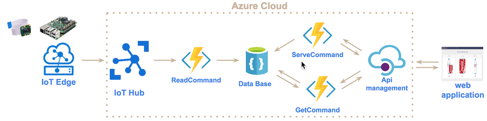
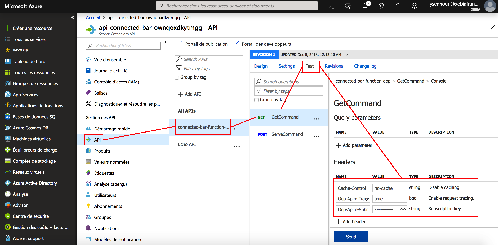

# IoT platform with Azure cloud

## Objective

The main objective of this project is to build an IoT plateform with Azure cloud from a fun use case. It deals with a `connected bar`.
Indeed, from a raspberry pi with an integrated camera you will be able to order a new drink by just putting your drink in front of the camera.
A machine learning model is installed on the device which recognizes the kind of drink and requests to a remote barter in the cloud to prepare the same drink.

The following picture shows you how it works.

## Architecture in the cloud

In terms of Azure components, here is the corresponding architecture :

Here is the meaning of each services:

- Azure IoT Hub : service to declare devices, to communicate with them through the protocol MQTT
- Azure Functions : serverless service that executes a programmed function from an event (new device message, http request..)
- Azure IoT Egde : service installed in device that enables tasks on device. Here, it controls camera, does image recognition and sends request to Iot Hub
- Azure CosmosDB : data base that is used to stored all commands
- Azure Api Management : service that manages REST API

About the three functions we created :

- ReadCommand : receive command and store in data base with status "not served"
- GetCommand : return all unserved command
- ServeCommand : for a command, change status to `served

## Architecture in the device

To install IoT Edge in your raspberry pi, you have to follow this [link](https://docs.microsoft.com/en-us/azure/iot-edge/how-to-install-iot-edge-linux).

In our use case `smart-bartender`, here is the architecture of modules installed in ioT Edge : 

There are two modules :

- Image classifier : HTTP server that can receive image and classify it thanks to a deep learning model
- Camera Capture : read video frame from pi camera and send a HTTP to Image classifier`. Then, send response to IoT Hub

## Installation

### Installation of Azure cli

The deployment is done through azure cli. So, you first need to install azure-cli depending your OS

    // For Mac 
    brew update && brew install azure-cli
    
### Connection to Azure Cloud with Azure cli

Link azure-cli with your Azure account : 

    az login

### Deploy Architecture

Run the script to install all services in the cloud :

    ./create-iot-architecture.sh
    
You will get as output :

- Connection string of iot hub that you will use for installation of Iot Egde in module [smart-bartender-iot-edge](https://github.com/ysennoun/smart-bartender-iot-edge.git)
- Connection string of edge device that you will use for installation of Iot Egde in module `smart-bartender-iot-edge`
- Container registry address to be used in module `smart-bartender-iot-edge`
- Container registry name to be used in module `smart-bartender-iot-edge`
- Container registry password to be used in module module `smart-bartender-iot-edge`

#### Configure REST API through Azure portal

##### Configuration

So far, Azure does not provide an efficient way to configure a REST API with a Function App through automatic deployment (cli, Azure Resource Manager, Teraform...)

Thus, we need to use the Azure portal to configure a REST API to use a Function App. Here is how to do.

First, as indicated in the image below, search in your Azure portal for service `api-connected-bar`. Then click on API and Function App to create an Rest Api where backend corresponds to a Function App.

secondly, you will get the following page where you need to click on `Browse` to search a specific Function App.

Thirdly, select as indicated in the image below the Function App `connected-bar-function-app`.

Fourthly, you will return to previous page where the following fields are already filled 

- Function App
- Display name
- Name
- API URL suffix 

Select `Unlimited` as product before to click on the button `Create`. 
 

Now, your REST API is created. However, you need to add the following configuration to be fully usable.

As indicated in the image below, for all operations go to `policies` in `Backend` tab.

Click on `base` and replace :

    <backend>
        <base />
    </backend>

by

    <backend>
        <forward-request timeout="20" />
    </backend>  

Now your REST API is fully configured.

##### Information

Let's retrieve necessary information in order to interact with this REST API from a remote web application.   

The following image enables you to get the root url of the REST API.

The following image enables you to get information to add in headers of a HTTP request.

## Web application

You can visualize commands through a web application by using the project [smart-bartender-web-application](https://github.com/ysennoun/smart-bartender-web-application.git).

In the file `server.js`, search the variables below and replace them with information retrieved in previous section.

- url
- User-Agent    
- Cache-Control
- Ocp-Apim-Trace
- Ocp-Apim-Subscription-Key
